<div align="center">

<h1>
  <span style="font-weight:900; letter-spacing:2px;">
    <span style="color:#76b900; font-weight:900;">L4P</span>: Towards Unified
    <span style="color:#76b900;">L</span>ow-Level 
    <span style="color:#76b900;">4</span>D Vision 
    <span style="color:#76b900;">P</span>erception
  </span>
</h1>

<p>
  <a href="https://arxiv.org/abs/2502.13078">
    
  </a>
  &nbsp;  &nbsp;
  <a href="https://research.nvidia.com/labs/lpr/l4p/">
    
  </a>
</p>

<p align="center">
  <a href="https://abadki.github.io/"><b>Abhishek Badki<sup>*</sup></b></a> &nbsp;  &nbsp;
  <a href="https://suhangpro.github.io"><b>Hang Su<sup>*</sup></b></a> &nbsp;  &nbsp;
  <a href="https://wenbowen123.github.io"><b>Bowen Wen</b></a> &nbsp;  &nbsp;
  <a href="https://oraziogallo.github.io"><b>Orazio Gallo</b></a>
</p>
<p style="font-size:0.95em; color:#888; margin-bottom:-0.5em;">* indicates equal contribution</p>

<br>


<br>

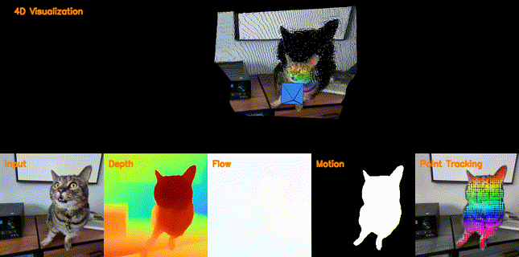 <br>

</div>

L4P is a feed-forward foundational model designed for multiple low-level 4D vision perception tasks. Given a monocular video without camera poses, L4P jointly solves several tasks using a shared video encoder backbone and lightweight, task-specific heads. The model is currently trained to predict depth, optical flow, 2D/3D point tracking, dynamic motion segmentation, and camera pose estimation, and can be extended to support additional tasks.

<p align="center">
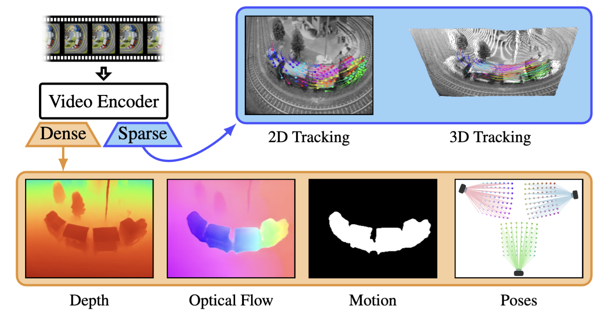
</p>

## News

- [2025/9] We released the inference code.

## Setup

The codebase is based on [Pytorch Lightning](https://lightning.ai/docs/pytorch/latest/) and [Lightning CLI](https://lightning.ai/docs/pytorch/stable/api/lightning.pytorch.cli.LightningCLI.html).


### Conda
```
conda create -n l4p python=3.10
conda activate l4p
pip install -r env/requirements.txt
```
You might need to install ffmpeg for `mediapy`. Follow instructions [here](https://github.com/google/mediapy?tab=readme-ov-file#setup).

### Docker
The following assumes that [Docker](https://docs.docker.com/desktop/setup/install/linux/) and [NVIDIA Container](https://docs.nvidia.com/datacenter/cloud-native/container-toolkit/latest/index.html) are properly installed.
Everything needed to build Docker locally is provided here: `env`

To build docker image for local use run: `docker build . -t l4p:local -f env/Dockerfile`. 
This will set up everything, including additional functionality for development using Docker and VSCode.
If you get any issues due to `viser` library, try building the image again.

To run on VSCode with docker, use the provided devcontainer file: `.devcontainer/devcontainer.json`.
Depending on your needs, you may want to update the mount paths based on where you store your data, results, SSH, and config files.
This can be done by modifying `mounts` section in `.devcontainer/devcontainer.json`.

Once inside docker container, to activate conda environment, use `source /workspace/miniconda3/bin/activate l4p`.


## Demo

We provide a demo showing several examples of running the model on all the tasks we support.

Download weights and sample data using:
```
cd weights
bash download.sh
cd -
cd demo/data
bash download.sh
cd -
```

Run the demo notebook `demo/demo.ipynb` or run the python file `cd demo; python demo.py`.
If you get an `OutOfMemoryError` error, you could set this flag `limit_gpu_mem_usage=True`.

Below are example visualizations from our model for depth, flow and 2D tracks.

<p align="center">
  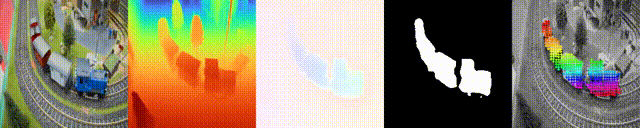
</p>
<p align="center">
  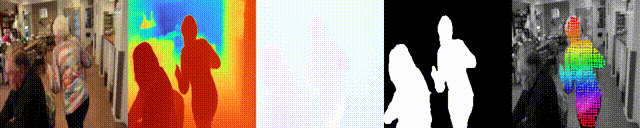
</p>
<p align="center">
  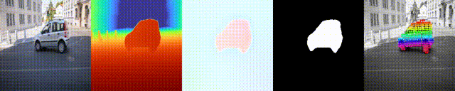
</p>
<p align="center">
  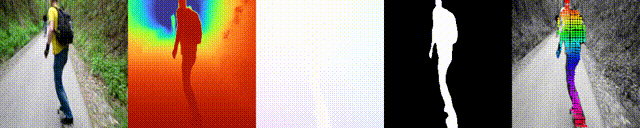
</p>
<p align="center">
  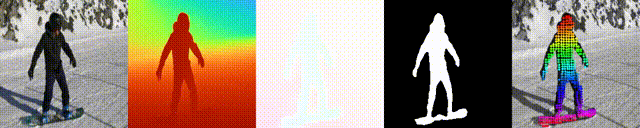
</p>
<p align="center">
  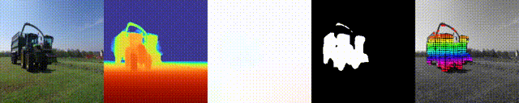
</p>
<p align="center">
  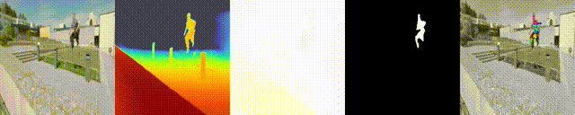
</p>
<p align="center">
  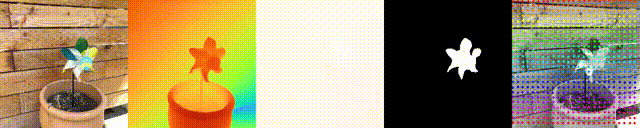
</p>
<p align="center">
  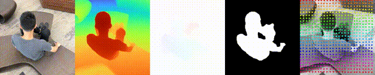
</p>
<p align="center">
  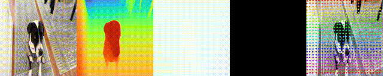
</p>

Because we estimate camera poses (with or without input intrinsics), we can visualize depth, camera poses, and 3D tracks within a consistent reference frame.

<p align="center">
  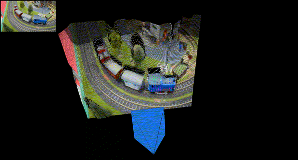
  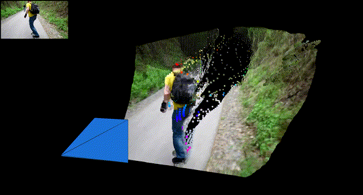
</p>
<p align="center">
  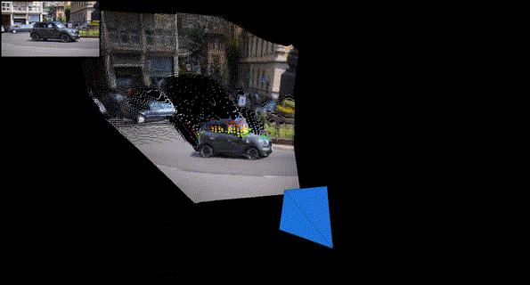
  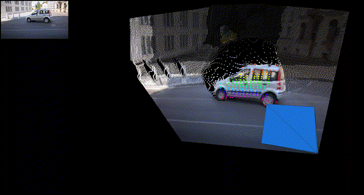
</p>
<p align="center">
  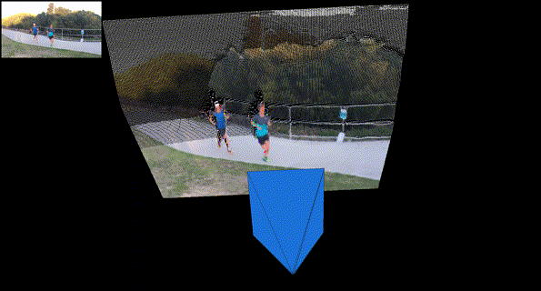
  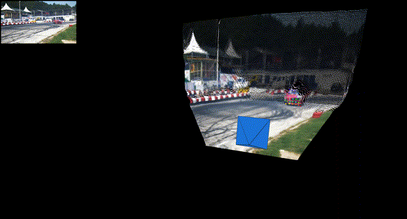
</p>
<p align="center">
  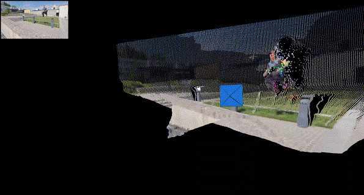
  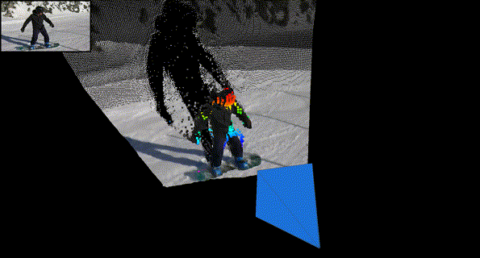
</p>


## Limitations and Future improvements
* Our approach is limited to 224 x 224 resolution.
* The depth, camera poses and 3D tracks are generated using different heads in a feedforward manner. 
So they might not be perfectly consistent with each other.
* Our current implementation of pose-alignment between overlapping windows is done on CPU, so a bit slow. A faster version is coming soon.

## References
The sample results shown above are from:
* Perazzi et al., A Benchmark Dataset and Evaluation Methodology for Video Object Segmentation, In IEEE Conference on Computer Vision and Pattern Recognition (CVPR), 2016.
* Gao et al., Monocular Dynamic View Synthesis: A Reality Check,  In Advances in Neural Information Processing Systems (NeurIPS), 2022.

## BibTeX
```bibtex
@article{badki2025l4p,
  author    = {Badki, Abhishek and Su, Hang and Wen, Bowen and Gallo, Orazio},
  title     = {{L4P}: Towards Unified {L}ow-Level {4D} Vision Perception},
  journal   = arxiv,
  year      = {2025},
}
```

